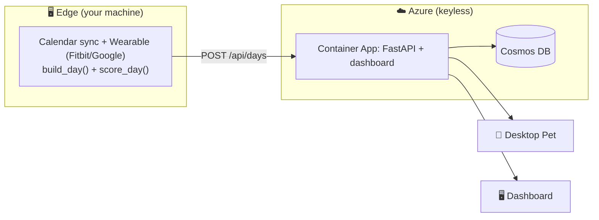

# 🐼 Pawse

> **Stay in flow — and know when to pawse.**

Your calendar might look full, but your body tells a completely different story.
**Pawse** reads both — combining meeting patterns with **real physiological signals**
from your Fitbit or Apple Watch (heart rate, HRV, movement).

It turns invisible stress into clear insights and one protective action:
**blocking recovery time before you burn out.**

> ⚠️ Pawse is **private, opt-in, and not a medical diagnosis.**

---

## 🧭 The flow

1. **Data** → sample workday (calendar + wearable + voice signals)
2. **Score** → turn signals into a Pawse Score + reasons
3. **App** → show it visually with the panda dashboard

```
┌────────────┐     ┌──────────────┐     ┌──────────────┐
│   data/    │ ──▶ │   scoring/   │ ──▶ │     app/     │
│ (Task 1)   │     │  (Task 2)    │     │   (Task 3)   │
└────────────┘     └──────────────┘     └──────────────┘
       ▲                  ▲
       │                  │
┌────────────┐     ┌──────────────────┐
│  devices/  │     │ voice-analysis/  │
│ fitbit /   │     │ teams video +    │
│ apple-watch│     │ voice biomarkers │
└────────────┘     └──────────────────┘
```


---

## 🏗️ Architecture — Edge · Cloud · Clients

Pawse runs across **three tiers**. All secrets, tokens and heavy work stay on the
**edge** (your machine); the **cloud** is a small, keyless store-and-serve layer;
the pet and dashboard are thin **read-only clients**.



- **Cloud** holds **no secrets** — only scores. It is deployed to Azure Container
  Apps + Cosmos (serverless, Managed Identity, no keys) and **auto-deploys on
  every push to `main`** via GitHub Actions (OIDC).
- **Edge agent** holds all OAuth tokens and media, collects + scores the day, and
  pushes it with [`tools/upload_day.py`](tools/upload_day.py) → `POST /api/days`.
- **Desktop pet** reads the **cloud** API (`PAWSE_API_URL`), so it works even when
  your local server is off.

> Full detail: [`docs/azure-architecture.md`](docs/azure-architecture.md) → *Implemented Architecture*.

---

## 📁 Project structure

| Folder | Purpose |
|---|---|
| [`data/`](data/) | **Task 1** — Sample workday ("Alex", an overloaded day) |
| [`scoring/`](scoring/) | **Task 2** — Pawse Score engine (signals → score + reasons + recommendations) |
| [`app/`](app/) | **Task 3** — Panda dashboard (score, charts, panda, actions) |
| [`devices/`](devices/) | **Core** — Live wearable data (Fitbit, Apple Watch, Google Health) |
| [`voice-analysis/`](voice-analysis/) | Teams video → voice biomarkers (stress index) |
| [`cloud/`](cloud/) | **Cloud** — FastAPI service + Cosmos store (serves the dashboard same-origin) |
| [`infra/`](infra/) | **Cloud** — Bicep IaC (Container Apps, Cosmos, Managed Identity, ACR, App Insights) |
| [`tools/`](tools/) | **Edge** — local collector that scores the day and uploads it to the cloud |
| [`desktop/`](desktop/) | Desktop panda pet (reads the cloud API) |
| [`docs/`](docs/) | Architecture, product vision, ML roadmap, prior art |

---

## 🚀 Quick start

```powershell
# (optional) virtual environment
python -m venv .venv
.\.venv\Scripts\Activate.ps1

# install dependencies
pip install -r requirements.txt

# run the scoring demo on sample data (no device needed)
python scoring/pawse_score.py

# open the dashboard (static, no backend required)
start app/index.html
```

---

## ⌚ Live mode — real wearable data

### Option A — Fitbit (direct API, recommended for hackathon)

```powershell
# 1) Set your Fitbit app credentials (get them at dev.fitbit.com)
$env:FITBIT_CLIENT_ID = "YOUR_CLIENT_ID"
$env:FITBIT_CLIENT_SECRET = "YOUR_CLIENT_SECRET"

# 2) One-time login (browser opens → Allow)
python devices/fitbit/fitbit_auth.py

# 3) Start the live dashboard
python server.py      # → http://localhost:8000
```

Dashboard shows **● LIVE (Fitbit)** and refreshes every 60 seconds with real HR + steps.

### Option B — Fitbit / Pixel Watch via Google Health API

```powershell
$env:GOOGLE_CLIENT_ID = "YOUR_CLIENT_ID.apps.googleusercontent.com"
$env:GOOGLE_CLIENT_SECRET = "YOUR_CLIENT_SECRET"
python devices/google_health/google_auth.py
python server.py
```

### Option C — Apple Watch (iOS Shortcut push)

See [`devices/apple-watch/README.md`](devices/apple-watch/README.md) for the
Shortcut automation that pushes HR + steps directly to the Pawse API.

### No device? No problem.

All clients fall back to **realistic mock data** automatically.
The demo always works — no OAuth needed.

---

## 🎯 Hackathon tasks

| Task | Folder | Goal |
|---|---|---|
| **Task 1** — Core demo scenario | [`data/`](data/) | One perfect overloaded-workday story ("Alex") |
| **Task 2** — Pawse Score + logic | [`scoring/`](scoring/) | 5 signals → score + reasons + recommendations |
| **Task 3** — Demo dashboard | [`app/`](app/) | Big score, charts, panda, "Protect tomorrow" button |
| **Core** — Live device integration | [`devices/`](devices/) | Real Fitbit or Apple Watch data in the demo |

> **The demo-winning moment:** real heart-rate data from a Fitbit **+** a
> real Outlook calendar block created with one click.
> That combination is what no slide can replace.
