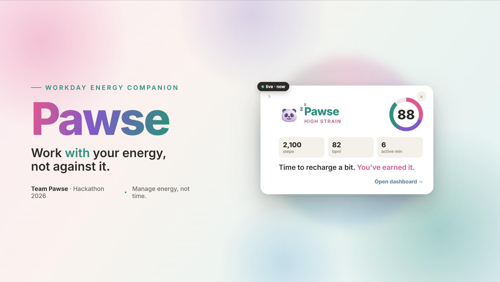
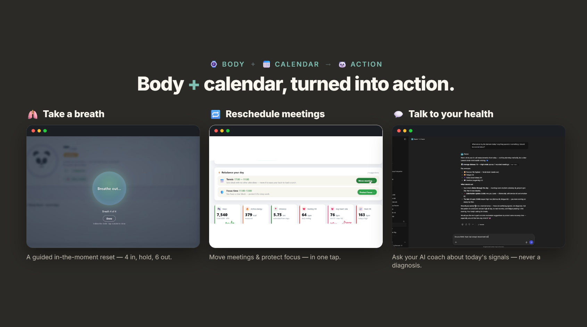
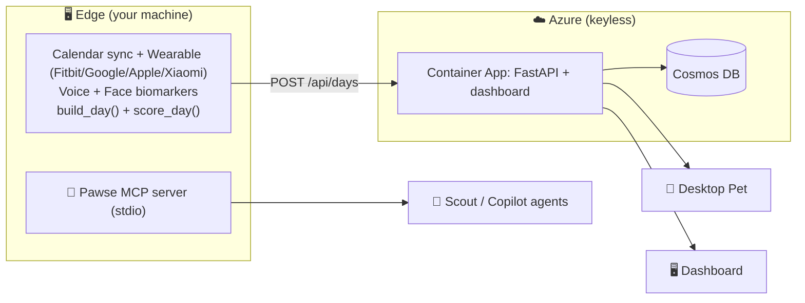

# 🐼 Pawse — Workday Energy Companion

> **Work *with* your energy, not against it. Stay in flow — and know when to pawse.**



Your calendar might look full, but your body tells a completely different story.
**Pawse** reads both — combining your **meeting patterns** with **real physiological
signals** (heart rate, HRV, movement from Fitbit / Apple Watch / Pixel Watch) and
even **voice & facial biomarkers** from your Teams recordings.

It turns invisible stress into one clear number, a few honest reasons, and a
single protective action: **rebalancing your day and blocking recovery time
before you burn out** — directly in your real calendar.

> ⚠️ Pawse is **private, opt-in, and not a medical device or diagnosis.**

---

## ✨ What Pawse does

- 🫁 **Take a breath** — a guided in-the-moment reset (4 in, hold, 6 out) when your signals spike.
- 🔁 **Reschedule meetings** — move meetings & protect focus + lunch in one tap, always with your approval.
- 💬 **Talk to your health** — ask your AI coach about today's signals — explained, never a diagnosis.



Pawse connects **three sources** no single tool combines:

```
        📅 CALENDAR            ⌚ BODY                🎙️ VOICE / FACE
        (what happened)      (how it reacts)       (how you sounded/looked)
             │                     │                     │
             └─────────────────────┼─────────────────────┘
                                   ▼
                        🐼 PAWSE SCORE (0–100)
                       explains · acts · protects
```

> **Whoop** knows your pulse — but not your calendar.
> **Reclaim** knows your calendar — but not your body.
> **Pawse** knows both — and acts for you.

---

## 🧭 The flow

1. **Collect** → real meetings (calendar) + wearable signals + voice/face biomarkers
2. **Score** → turn signals into a **Pawse Score (0–100)** + a strain label + honest reasons
3. **Act** → recommend & apply reschedules, protect focus/lunch, or take a breath
4. **Show** → the panda dashboard + desktop pet reflect your state and speak up at the right moment

```
┌────────────┐     ┌──────────────┐     ┌──────────────┐     ┌──────────────┐
│  collect   │ ──▶ │    score     │ ──▶ │     act      │ ──▶ │     show     │
│ calendar + │     │ Pawse Score  │     │ reschedule / │     │ dashboard +  │
│ wearable + │     │ + reasons    │     │ protect /    │     │ panda pet    │
│ biomarkers │     │              │     │ breathe      │     │              │
└────────────┘     └──────────────┘     └──────────────┘     └──────────────┘
```

---

## 🏗️ Architecture — Edge · Cloud · Clients · Agents

Pawse runs across **three tiers**. All secrets, tokens and heavy work stay on the
**edge** (your machine); the **cloud** is a small, keyless store-and-serve layer;
the pet, dashboard and AI agents are thin **clients** that read the API.



- **Cloud** holds **no secrets** — only scores. Deployed to Azure Container Apps +
  Cosmos (serverless, Managed Identity, no keys) and **auto-deploys on every push
  to `main`** via GitHub Actions (OIDC).
- **Edge agent** holds all OAuth tokens and media, collects + scores the day, and
  pushes it with [`tools/upload_day.py`](tools/upload_day.py) → `POST /api/days`.
  See [`agent/pawse_agent.py`](agent/pawse_agent.py) for the unified automatic collector.
- **MCP server** ([`pawse_mcp.py`](pawse_mcp.py)) exposes Pawse's recommendations as
  tools so agents (Microsoft Scout, GitHub Copilot, VS Code Copilot) can reschedule
  your day — with your approval.
- **Desktop pet** reads the **cloud** API (`PAWSE_API_URL`), so it works even when
  your local server is off.

> Full detail: [`docs/azure-architecture.md`](docs/azure-architecture.md).

---

## 📁 Project structure

| Folder / file | Purpose |
|---|---|
| [`scoring/`](scoring/) | **Pawse Score engine** — signals → score + reasons + recommendations + meeting optimizer |
| [`app/`](app/) | **Panda dashboard** — score, charts, panda emotion, actions |
| [`data/`](data/) | Sample workday ("Alex", an overloaded day) + caches (calendar, biomarkers, media) |
| [`devices/`](devices/) | **Live wearables** — Fitbit, Apple Watch, Google Health (Pixel), Xiaomi, Outlook calendar |
| [`voice-analysis/`](voice-analysis/) | Teams video → **voice + facial biomarkers** (stress index, FER ONNX) |
| [`server.py`](server.py) | Local live server — serves the dashboard + `/api/live-day`, `/api/recommendations` |
| [`pawse_mcp.py`](pawse_mcp.py) | **MCP server** — exposes day, recommendations, biomarkers & a task queue to agents |
| [`pawse_queue.py`](pawse_queue.py) · [`pawse_events.py`](pawse_events.py) · [`pawse_biomarkers.py`](pawse_biomarkers.py) | Task queue, event log & biomarker helpers behind the MCP server |
| [`agent/`](agent/) | **Edge agent** — automatic collector (live day + new Teams recordings) |
| [`cowork/`](cowork/) · [`scout/`](scout/) | **Skills** — `pawse-reschedule` / `pawse-watch` for Scout & Copilot |
| [`copilot-agent/`](copilot-agent/) | Pawse agent definition for Copilot |
| [`cloud/`](cloud/) | **Cloud** — FastAPI service + Cosmos store + Teams bot + coach |
| [`infra/`](infra/) | **Cloud IaC** — Bicep (Container Apps, Cosmos, Managed Identity, ACR, App Insights) |
| [`tools/`](tools/) | **Edge** — local collector that scores the day and uploads it to the cloud |
| [`desktop/`](desktop/) | Desktop panda pet (reads the cloud API) |
| [`teams/`](teams/) | Teams app manifest |
| [`PawseDashboard/`](PawseDashboard/) | Standalone analytics dashboard (Streamlit) on sample data |
| [`docs/`](docs/) | Architecture, product vision, ML roadmap, prior art |

---

## 🚀 Quick start

```powershell
# (optional) virtual environment
python -m venv .venv
.\.venv\Scripts\Activate.ps1

# install dependencies
pip install -r requirements.txt

# run the scoring demo on sample data (no device needed)
python scoring/pawse_score.py

# run the live dashboard (falls back to realistic mock data automatically)
python server.py        # → http://localhost:8000
```

---

## ⌚ Live mode — real wearable data

### Option A — Fitbit (direct API)

```powershell
$env:FITBIT_CLIENT_ID = "YOUR_CLIENT_ID"
$env:FITBIT_CLIENT_SECRET = "YOUR_CLIENT_SECRET"
python devices/fitbit/fitbit_auth.py   # one-time browser login → Allow
python server.py                        # → http://localhost:8000
```

The dashboard shows **● LIVE (Fitbit)** and refreshes every 60 s with real HR + steps.

### Option B — Fitbit / Pixel Watch via Google Health API

```powershell
$env:GOOGLE_CLIENT_ID = "YOUR_CLIENT_ID.apps.googleusercontent.com"
$env:GOOGLE_CLIENT_SECRET = "YOUR_CLIENT_SECRET"
python devices/google_health/google_auth.py
python server.py
```

### Option C — Apple Watch (iOS Shortcut push)

See [`devices/apple-watch/README.md`](devices/apple-watch/README.md) for the
Shortcut that pushes HR + steps directly to the Pawse API.

### Option D — Xiaomi / Gadgetbridge

Set `PAWSE_WEARABLE=xiaomi` and see [`devices/xiaomi/README.md`](devices/xiaomi/README.md).

### No device? No problem.

All clients fall back to **realistic mock data** automatically — the demo always works.

---

## 🔌 Use Pawse from an AI agent (MCP)

The [`pawse_mcp.py`](pawse_mcp.py) **local stdio MCP server** lets agents pull
Pawse's recommendations and act on them — no deploy, no tunnel.

**Register in Microsoft Scout / Copilot:** Extensions → MCP Servers → **+ Add Server** → **Command**:

```
"C:\path\to\python.exe" "C:\path\to\Pawse\pawse_mcp.py"
```

Then ask: *"Optimize my day with Pawse"* → it calls `get_recommendations` and
reschedules with your approval.

**Tools exposed:**

| Tool | What it returns |
|---|---|
| `get_recommendations(date?)` | concrete reschedule suggestions for a day |
| `get_day(date?)` | the scored Pawse day (score, label, meetings, …) |
| `get_biomarkers(date?)` | per-meeting voice + face biomarkers (+ day rollup) |
| `sync_queue` / `claim_next_task` / `complete_task` | task queue (Pawse recommends → agent executes) |
| `approve_task` / `reject_task` | gate shared calendar moves on explicit user OK |

The matching agent skills live in [`cowork/pawse-reschedule`](cowork/pawse-reschedule/SKILL.md)
and [`scout/skills`](scout/skills/) (`pawse-reschedule`, `pawse-watch`).

---

## 🧮 How the Pawse Score works

The score (0–100) is a weighted sum of five signals, each contributing an honest,
human-readable reason (see [`scoring/pawse_score.py`](scoring/pawse_score.py)):

| Signal | Weight | Triggers when… |
|---|---|---|
| Meeting load | 25 | many meetings in a day |
| Back-to-backs | 20 | several meetings with no gap |
| No breaks | 15 | lunch / recovery break missing |
| Low movement | 20 | step count below threshold |
| Elevated heart rate | 20 | HR spikes well above resting baseline |

| Score | Label | Panda state |
|---|---|---|
| 0–39 | Low strain | 😌 relaxed |
| 40–69 | Medium strain | 😐 alert / a bit tired |
| 70–100 | High strain | 😵 needs a pawse |

---

## ☁️ Cloud & deployment

The cloud tier ([`cloud/`](cloud/)) is a FastAPI service backed by Cosmos DB,
deployed to Azure Container Apps via Bicep ([`infra/`](infra/)). It stores **only
scores — no secrets** — and emits the Pawse Score as a `pawse.score` custom metric
to Application Insights, so organisational wellbeing can be charted live.

```powershell
azd up        # provision + deploy (Container Apps, Cosmos, ACR, App Insights)
```

Every push to `main` auto-deploys via GitHub Actions (OIDC, keyless).

---

<p align="center">
  
</p>

---

## 📚 Docs

- [`docs/product-vision.md`](docs/product-vision.md) — *what* makes Pawse unique & the pitch
- [`docs/azure-architecture.md`](docs/azure-architecture.md) — the implemented cloud architecture
- [`docs/ml-and-teams-integration.md`](docs/ml-and-teams-integration.md) — ML roadmap & Teams integration
- [`docs/research-prior-art.md`](docs/research-prior-art.md) — prior art & differentiation

---

> *Team Pawse · Hackathon 2026 — manage energy, not time.*
