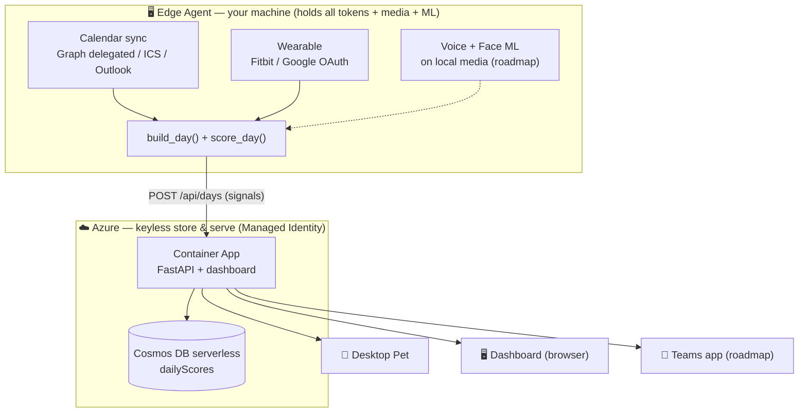
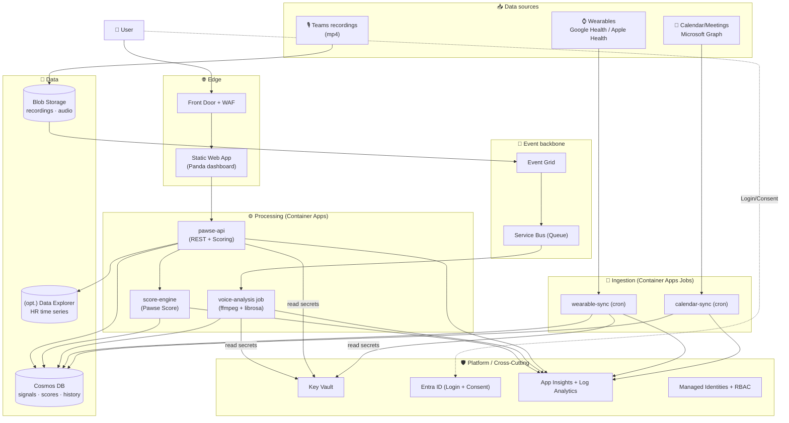
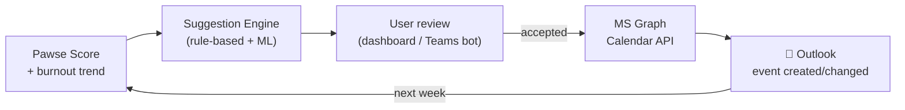

# 🏛️ Pawse — Azure Architecture (Target State)

> Scalable, event-driven design for **the entire Pawse project** on Azure.
> Region: **West Europe**. IaC: **Terraform**. Status: *Planning (no deployment yet)*.

Pawse reads signals from **calendar/meetings**, **wearables** (heart rate, movement)
and **voice biomarkers** from Teams meetings, computes a **Pawse Score (0–100)**,
explains the *why*, and suggests recovery actions.

> ⚠️ Health data → **privacy-by-design, opt-in, not a medical diagnostic tool.**

---

## ⭐ Implemented Architecture — Edge · Cloud · Clients (As-Built, June 2026)

> Sections 1–6 below describe the **full target state**. This section is what is
> **actually deployed today**: a deliberately simple, privacy-first split across
> three tiers. All secrets, tokens, raw media and heavy ML stay on the **edge**;
> the **cloud** is a small, keyless store-and-serve layer; everything else is a
> thin, read-only **client**.



### The three tiers

| Tier | Runs on | Holds | Responsibility |
|---|---|---|---|
| **☁️ Cloud** | Azure (always-on) | **no secrets** — only scores | Store + serve: API, Cosmos, dashboard, CI/CD. *Source of truth for history.* |
| **🖥️ Edge Agent** | your machine (background) | **all tokens + media + ML** | Collect, analyze, score, upload. *Source of truth for raw signals.* |
| **👀 Clients** | Pet, browser, Teams app | nothing | **Read-only** consumers of the cloud API. |

**Core principle:** OAuth tokens (Fitbit/Google/Graph), recordings and the heavy
ML models **never leave the edge**. The cloud only ever sees finished numbers —
which is why it can stay keyless (Managed Identity → Cosmos) and is the basis of
the GDPR/privacy story.

### The Pawse Agent

The edge work is consolidated into a single background service
(`agent/pawse_agent.py`, roadmap) that runs on a schedule (e.g. every 15 min):

1. **Sync calendar** → meetings + derived breaks
2. **Pull wearable** → steps / HR / HRV (Fitbit *or* Google)
3. **Analyze local media** → voice / face signals *(roadmap)*
4. **Pull WorkIQ text** (when run interactively) → sentiment / pressure language
5. **`build_day()` + `score_day()`** → `POST /api/days` to the cloud

It replaces the one-shot uploader; [`tools/upload_day.py`](../tools/upload_day.py)
becomes a thin "push once" wrapper around it.

### Desktop Pet reads the cloud

The pet ([`desktop/pawse_pet.py`](../desktop/pawse_pet.py)) is a pure client.
Instead of `http://localhost:8000`, it reads the **cloud** API
(`/api/live-day?userId=me`, URL via `PAWSE_API_URL`). That way it works **always
and everywhere** — even when the local `server.py` is off it shows the last score
the agent pushed. (Optional: prefer a local server when one is running, for
sub-minute freshness.)

### Calendar sync — options (no admin consent)

WorkIQ is **author-time only** (it runs inside the IDE), so it is a seed/demo
source, not an automatable sync. For real sync the agent uses, in order:

| # | Method | Admin consent? | Auto? | Use |
|---|---|---|---|---|
| 1 | **Graph delegated** `Calendars.Read` + `/me/calendarView/delta` | user-consent only (no admin) *where the tenant allows it* | ✅ incremental (delta) | 🥇 preferred — test first |
| 2 | **ICS feed** (Outlook "publish calendar" → secret .ics URL) | ❌ none | ✅ polling | 🥈 robust fallback |
| 3 | **Outlook desktop via COM** (`win32com`) | ❌ none | ✅ local | 🥉 Windows-only, fully local |
| 4 | **WorkIQ** (M365 Copilot, author-time cache) | ❌ none | ❌ manual | seed / demo (current) |

`data/calendar_cache.json` stays the local cache the agent keeps fresh.

### Wearable provider switch

Every adapter in [`devices/`](../devices/) implements the same
`get_daily_signals(date)` contract, so providers are interchangeable via one
env var — no code change when switching device:

```
PAWSE_WEARABLE = fitbit | google | apple    # default: google
```

Fitbit uses the same personal-OAuth pattern as Google
([`devices/google_health/google_auth.py`](../devices/google_health/google_auth.py)) —
register a *Personal* app at dev.fitbit.com, no admin consent. Tokens are stored
locally (gitignored) and **never** sent to the cloud.

---

## 1. Design Principles

| Principle | Implementation |
|---|---|
| **Event-driven & decoupled** | Ingestion → Event Grid/Service Bus → Processing → Storage. No blocking pipelines. |
| **Scale-to-zero** | Container Apps & Jobs scale to 0 when idle → minimal cost, true load scaling. |
| **Zero secrets in code** | All secrets in **Key Vault**, access only via **Managed Identity** (no keys/passwords). |
| **Privacy-by-design** | Health data encrypted, granular consent, data minimization, deletion paths (GDPR). |
| **Multi-source & extensible** | Every data source is an interchangeable connector (Google Health, Apple, MS Graph …). |
| **Multi-user capable** | Isolated tokens & data per user, Entra login, tenant separation in Cosmos. |
| **Observability first** | Distributed tracing across all components (App Insights + Log Analytics). |

---

## 2. Logical Architecture (Overview)



---

## 3. Azure Service Mapping (all components)

| Pawse building block | Repo folder | Azure service | Rationale |
|---|---|---|---|
| Panda dashboard | `app/` | **Static Web Apps** | Static front-end, global CDN, integrated Entra login |
| Pawse Score + REST API | `scoring/`, `server.py` | **Container Apps** (FastAPI) | Scale-to-zero, autoscaled, Python without K8s overhead |
| Calendar ingestion | *(new)* | **Container Apps Job** (cron) + **MS Graph** | Fetches meetings/back-to-backs on a schedule |
| Wearable ingestion | `devices/` | **Container Apps Job** (cron) + adapter | Adapter per device (Google Health, Apple, Garmin, Polar …) |
| Voice biomarker | `voice-analysis/` | **Container Apps Job** (event-triggered) + **Azure ML** | Feature extraction + ML model for burnout detection |
| Score/signal history | `data/` | **Cosmos DB (serverless)** | 1 document per user/day, cheap, autoscaled |
| Recordings & audio | — | **Blob Storage** + lifecycle | Large media, automatic archiving/deletion (GDPR) |
| HR time series (optional) | — | **Azure Data Explorer** | If high-resolution intraday HR is analyzed |
| Decoupling | — | **Event Grid + Service Bus** | Upload events → jobs, retry, dead-letter |
| Secrets & tokens | — | **Key Vault** | Google OAuth secrets + per-user tokens, MI access |
| User login & consent | — | **Entra ID** (external/B2C) | Opt-in, granular consent |
| Monitoring | — | **App Insights + Log Analytics** | End-to-end tracing, alerts, dashboards |
| Identities/permissions | — | **Managed Identity + RBAC** | Least-privilege, no keys |

---

## 3a. Wearable Adapter Pattern

Every adapter in `devices/` implements the same interface:

```python
def get_daily_signals(date: str) -> dict[str, Any]:
    return { "source": "...", "steps": ..., "resting_hr": ..., "hr_samples": [...] }
```

Which adapter is active is controlled by a user setting in Cosmos — no code change when switching devices.
All adapters **fall back to mock data** when no token is present, so the demo
never depends on a physical device.

| Adapter | Source / Protocol | Status | Hackathon |
|---|---|---|---|
| `fitbit` | Fitbit Web API (OAuth2, direct) | ✅ live + mock | **Primary** |
| `google_health` | Google Health API v4 (Fitbit, Pixel Watch) | ✅ live + mock | Alternative / Long-term |
| `apple_watch` | iOS Shortcuts → HTTP POST **or** HealthKit XML | 🟡 Option B ready | iPhone users |
| `garmin` | Garmin Health API (OAuth1) | planned | Roadmap |
| `polar` | Polar Open API (OAuth2) | planned | Roadmap |
| `manual` | Upload JSON payload manually | planned | Fallback without a device |

**Fitbit direct vs. Google Health:**
- For the hackathon, `fitbit` is the simpler path (dev.fitbit.com → create app → done).
- `google_health` is the future-proof alternative after the Fitbit API sunset (Sep 2026).
- Both deliver the same normalized output — the rest of the system sees no difference.

**Apple Watch special path:** Apple does not allow direct server access to HealthKit.
- **Option B (recommended):** an iOS Shortcut sends data daily via HTTP POST to the Pawse API.
  Setup guide: [`devices/apple-watch/README.md`](../devices/apple-watch/README.md).
- Option A: the user exports `export.xml` → upload to Blob → adapter parses the XML (batch mode).

---

## 3b. Voice Analysis & ML Burnout Detection

### Data flow: Teams → Burnout Score

```
Teams recording (mp4)
  → OneDrive/SharePoint
  → MS Graph Webhook
  → Blob Storage (temporary, TTL deletion after X days, GDPR)
  → Event Grid
  → Service Bus Queue
  → voice-analysis job (Container App):
      ffmpeg  →  WAV audio
              →  Feature Extraction (openSMILE / librosa)
              →  ML model  →  { stress_index, strain_label }
  → Cosmos DB (result only, no raw audio)
```

### ML tiers (from simple → precise)

**Tier 1 — Classic (currently in the repo):**
`librosa` → pitch variability, jitter/shimmer, pause ratio, speech rate, energy → weighted blend.
Good for the demo, no training needed.

**Tier 2 — openSMILE + eGeMAPS (next step):**
`opensmile` (eGeMAPSv02, 88 features) → SVM / XGBoost.
Established feature set for emotion/stress, speaker-independent, runs on CPU.

**Tier 3 — Deep Learning (scales):**
`wav2vec 2.0` or `Whisper` as feature extractor → fine-tuning on the DAIC-WOZ dataset (depression/burnout interviews) + self-collected labels.
Azure ML / Azure AI Foundry for training + serving.

### Training-data strategy

| Phase | Data source | Labeling strategy |
|---|---|---|
| Start | DAIC-WOZ (public) + own recordings | User rates their own stress level after a meeting |
| Mid | Pawse sessions (self-supervised) | Pawse Score > 70 + voice segment = auto-label |
| Long-term | Per-user model | Fine-tuning on individual voice baseline |

> ⚠️ Voice analysis requires **explicit consent**, raw audio may only be stored temporarily (TTL), and results are not medical.

> 📎 **Specific pretrained models, datasets, and the exact path to the Teams data**
> (Graph Transcript API / callRecords vs. real-time media bot vs. Viva/WorkIQ) as well as
> **visible integrations in Teams/Outlook** are described in
> [`ml-and-teams-integration.md`](ml-and-teams-integration.md).

---

## 4. Data Source Integration

### 4.1 Calendar / Meetings (Microsoft Graph)
- The `calendar-sync` job reads each user's appointments for the day (`/me/calendarView`).
- Computes **meeting density**, **back-to-backs**, **after-hours**, **missing breaks**.
- Writes normalized data to Cosmos (`meetings` part of the daily document).

### 4.2 Wearables (Google Health API — Fitbit/Pixel; Apple Health)
- The `wearable-sync` job reads **steps**, **resting HR**, **HR samples** via `health.googleapis.com/v4`.
- **Token storage:** instead of a local `google_tokens.json` → **one Key Vault secret per user**
  (`pawse-google-token-{userId}`), with automatic refresh.
- Apple Health as a second connector (HealthKit export upload) — same target structure.

### 4.3 Voice Biomarker (Teams recordings)
- Upload `.mp4` → **Blob Storage** → **Event Grid** fires → **Service Bus** queue → `voice-analysis` job.
- Job: ffmpeg extracts audio → librosa computes pitch/jitter/shimmer/pauses → `avg_stress_index`.
- Result to Cosmos; raw audio automatically deleted after X days via a lifecycle rule.

---

## 5. Data Model (Cosmos DB)

### Container `days` — Partition Key `/userId` (reactive signals, daily)

```jsonc
{
  "id": "alex@contoso.com_2026-06-18",
  "userId": "alex@contoso.com",
  "date": "2026-06-18",

  // --- Calendar signals (from calendar-sync) ---
  "meetings": [
    {
      "title": "Sprint Planning",
      "start": "14:00", "end": "15:30",
      "back_to_back": true,
      "after_hours": false,
      "attendees_count": 8,        // new: group size
      "is_organizer": true,        // new: own vs. others' meetings
      "has_agenda": false,         // new: analyzed from the meeting body
      "response_status": "accepted"
    }
  ],
  "meeting_stats": {              // new: precomputed aggregates
    "total_count": 8,
    "back_to_back_count": 3,
    "total_meeting_minutes": 310,
    "deep_work_blocks": [],       // free blocks ≥ 90 min
    "first_meeting": "09:00",
    "last_meeting": "19:45"
  },

  // --- Wearable signals ---
  "wearable": {
    "source": "google-health",
    "steps": 700,
    "resting_hr": 62,
    "hr_samples": [...],
    "hrv": 28,                    // new: Heart Rate Variability (recovery indicator)
    "sleep_hours": 5.8,           // new: sleep duration of the previous night
    "sleep_quality_score": 61,    // new: Fitbit Sleep Score
    "active_minutes": 12          // new: active minutes
  },

  // --- Voice biomarker (from voice-analysis job) ---
  "voice": {
    "source": "teams",
    "analyzed_segments": 2,
    "avg_stress_index": 0.74,
    "speaking_ratio": 0.62,       // new: share spoken by the user
    "interruption_count": 4,      // new: interruptions (speaker-change analysis)
    "energy_trend": "declining",  // new: energy trend over the day
    "ml_model_version": "egemaps-v02-xgb-1.3"
  },

  // --- Computed scores ---
  "pawse_score": 82,
  "label": "High strain",
  "reasons": [...],
  "recommendations": [...],
  "component_scores": {           // new: breakdown per dimension
    "meeting_load": 45,
    "recovery": 22,
    "movement": 8,
    "voice_stress": 20,
    "sleep": 7
  },

  // --- Privacy ---
  "_consent": { "wearable": true, "voice": true, "calendar": true },
  "_ttl": { "raw_voice": 172800 } // delete raw audio after 2 days
}
```

### Container `trends` — Partition Key `/userId` (aggregated time series, weekly)

```jsonc
{
  "id": "alex@contoso.com_2026-W25",
  "userId": "alex@contoso.com",
  "week": "2026-W25",
  "avg_pawse_score": 74,
  "avg_meeting_minutes_per_day": 290,
  "avg_steps": 1200,
  "avg_hrv": 31,
  "avg_sleep_hours": 6.1,
  "voice_stress_trend": "increasing",
  "burnout_risk_score": 0.68,     // ML output (0..1)
  "burnout_risk_label": "elevated",
  "days_high_strain": 4,
  "deep_work_ratio": 0.14         // share of the workday with focus time ≥ 90 min
}
```

### Container `suggestions` — Partition Key `/userId` (suggestions + feedback)

```jsonc
{
  "id": "uuid",
  "userId": "alex@contoso.com",
  "created_at": "2026-06-18T18:00:00Z",
  "type": "calendar_block" | "meeting_reschedule" | "buffer_insert" | "async_convert",
  "status": "pending" | "accepted" | "declined" | "auto_applied",
  "suggestion": {
    "title": "Focus time: Deep Work",
    "start": "2026-06-19T09:00:00",
    "end": "2026-06-19T11:00:00",
    "reason": "3 back-to-back meetings today + HRV decline — protect focus time early tomorrow"
  },
  "graph_event_id": "AAMk...",    // set when written to Outlook
  "user_feedback": null           // "helpful" | "not_helpful" → model training
}
```

---

## 6. Data Optimizations & Predictive Layer

### 6a. New signals that improve the score

| Signal | Source | Why it's valuable |
|---|---|---|
| **HRV** (Heart Rate Variability) | Google Health / Fitbit | Best single biomarker for recovery/overload |
| **Sleep duration + quality** | Google Health (Fitbit Sleep Score) | Previous sleep explains today's stress level |
| **Agenda present?** | MS Graph (meeting body) | Meetings without an agenda = higher cognitive weight |
| **Own vs. others' meetings** | MS Graph (`isOrganizer`) | Attendee-only ≠ organizer — different load |
| **Deep work blocks** | Calendar analysis | Free blocks ≥ 90 min = focus capacity |
| **Speaking share in the meeting** | Voice analysis (diarization) | Talking a lot = more exhaustion |
| **Energy trend over the day** | Voice (energy/RMS curve) | Declining energy = exhaustion signal |
| **Movement between meetings** | Steps intraday | A short walk between calls = recovery |

### 6b. Burnout risk model (predictive, weekly)

Based on the last 7–30 days, a **burnout risk score (0..1)** is computed:

```
Inputs:                           Model:
  avg_pawse_score (7d)            XGBoost / LightGBM
  trend pawse_score (rising?)     → burnout_risk_score (0..1)
  avg_hrv_trend (falling?)        → Label: low / elevated / high
  avg_sleep_hours_trend
  deep_work_ratio
  voice_stress_trend
  days_high_strain (7d)
```

Trained on DAIC-WOZ + own labels (self-report after a meeting). Azure ML for training, serving as a Container Apps Job (weekly batch).

---

## 7. Outlook/Teams Integration (Closed Loop)

This is the decisive step from "looking at a dashboard" to "Pawse acts for you":



### What the MS Graph Calendar API can concretely do (researched)

| Graph endpoint | What Pawse does with it |
|---|---|
| `GET /me/calendarView` | Fetches all appointments in a time window (incl. attendees, body, isOrganizer) |
| `POST /me/events` | Creates a focus-time block / buffer directly in Outlook |
| `PATCH /me/events/{id}` | Changes an appointment (e.g., shift the time for a suggestion) |
| `GET /me/findMeetingTimes` | Finds optimal time slots based on the free/busy status of all attendees |
| `GET /me/getSchedule` | Fetches free/busy info of colleagues → better suggestions |
| `POST /me/events/{id}/accept` | Automatically accept/decline (with consent) |
| `PATCH event.extensions` | Stores Pawse metadata on the event (e.g., `pawse_suggestion_id`) |
| **Change Notifications** | Webhook: Outlook reports immediately when a new appointment is created |

### Types of meeting suggestions

**1. Schedule a focus-time block**
Pawse detects: 7 meetings tomorrow, no free hour. Suggestion:
→ `POST /me/events` with `showAs: "Busy"`, title "🐼 Focus time (Pawse)", 09:00–11:00.
→ User confirms in the dashboard or directly in the Teams bot.

**2. Insert a buffer between back-to-backs**
Detects: 3 meetings directly in a row. Suggestion:
→ Shows: "Shift Meeting B by 15 min to create a 10 min buffer?" → `PATCH /me/events/{id}`.

**3. Convert a meeting to async**
Detects: meeting without an agenda, 1:1, no mandatory need to synchronize. Suggestion:
→ "Turn this meeting into an async email? I'll remove the appointment and draft the email." → `DELETE event` + `POST /me/sendMail`.

**4. Find the optimal meeting time slot**
When the user schedules a new meeting, Pawse suggests a time slot that
- comes after a break
- accounts for the HRV/energy curve (more productive in the morning)
- uses `findMeetingTimes` for all attendees.

**5. Proactive burnout alert**
burnout_risk > 0.7 + 3 consecutive high-strain days:
→ Teams bot message: "Your last week was very intense. Should I protect meeting-free blocks next week?"

### Teams Add-In / Outlook Add-In

Two integration points (to be planned):

| Integration | Technology | What it does |
|---|---|---|
| **Outlook Add-In** | Office.js (React) | Pawse panel on the right in Outlook → shows the score, suggests directly while creating an appointment |
| **Teams Messaging Extension** | Teams Bot Framework | `/pawse` command in Teams chat → shows today's score, confirms suggestions via Adaptive Card |
| **Teams Meeting App** | Teams tab in a meeting | Live stress indicator during the meeting (from HR data) |

The Outlook Add-In is the most important entry point: it appears natively in Outlook and the user doesn't have to open the dashboard separately.

---

## 8. Data Optimization: Feedback Loop for ML Training

---

## 8. Data Optimization: Feedback Loop for ML Training

The key point: **every user interaction is a training signal.**

```
Suggestion created
  → User: "helpful" / "not_helpful" / ignored
  → stored in suggestions.user_feedback
  → weekly retrain job (Azure ML):
      Suggestion accepted + lower score next week = positive signal
      Suggestion declined = negative signal
  → Model improves with every user
```

Three levels of personalization over time:

| Level | When | What |
|---|---|---|
| **Population model** | Start | Trained on DAIC-WOZ + aggregated Pawse data |
| **User-cluster model** | From ~100 users | User is assigned to a cluster (e.g., "many meetings, little sleep") |
| **Personal model** | From ~30 days of usage | Fine-tuning on individual voice baseline + HR baseline |

---

## 9. Security & Privacy (health data!)

- **Managed Identity everywhere** → no secret in code; Key Vault access via RBAC.
- **Encryption**: at-rest (platform) + optional Customer-Managed Keys; TLS in-transit.
- **Private Endpoints** for Cosmos, Blob, Key Vault → no public data path.
- **Consent management**: per data source (`_consent`), revocable at any time → stops sync + deletes.
- **GDPR**: data minimization, right to erasure (Cosmos doc + Blob + token secret), audit logs.
- **WAF + Front Door**: protection against web attacks, rate limiting.
- **Least Privilege**: each component gets only the RBAC roles it needs.
- **Outlook write access only with explicit consent**: `Calendars.ReadWrite` scope as a separate opt-in.
- **Voice data**: raw audio TTL 2 days, only feature vectors + score kept permanently.

---

## 10. Scaling & Reliability

| Aspect | Pattern |
|---|---|
| Load spikes | Container Apps **KEDA autoscaling** (HTTP concurrency / queue length) |
| Idle costs | **Scale-to-zero** for API & jobs |
| Long/heavy tasks | **Service Bus queue** + worker job (voice), retry + dead-letter |
| Transient errors | **Exponential backoff** in all external calls (Google/MS Graph) |
| Rate limits | Sync as a **batch job** (cron) instead of per request; caching of daily data |
| Resilience | Zone-redundant services; Cosmos multi-region optional |

---

## 11. Environments & Terraform Structure (target state)

```
infra/
  main.tf                 # Provider, resource group, naming convention
  variables.tf            # Region (westeurope), env, tags
  modules/
    network/              # VNet, subnets, private endpoints
    security/             # Key Vault, managed identities, RBAC assignments
    container_apps/       # ACA environment, api, calendar-sync, wearable-sync, voice, suggestion-engine
    static_web/           # Dashboard
    data/                 # Cosmos DB (serverless) + Storage Account
    messaging/            # Event Grid + Service Bus
    observability/        # Log Analytics + App Insights + Alerts
    ml/                   # Azure ML Workspace, compute, endpoints
  envs/
    dev.tfvars
    prod.tfvars
```

- **Naming**: `pawse-<env>-<service>` (e.g., `pawse-prod-api`).
- **State**: remote backend in Azure Storage + state locking.
- **dev/prod separation** via `*.tfvars`, identical modules → consistent stages.

---

## 12. Well-Architected Quick Check

| Pillar | Lever in this design |
|---|---|
| **Reliability** | Queues + retry + dead-letter, zone-redundant, health probes |
| **Security** | Managed Identity, Key Vault, Private Endpoints, WAF, consent/GDPR |
| **Cost** | Scale-to-zero, Cosmos serverless, Blob lifecycle, Static Web Apps Free Tier |
| **Operational Excellence** | Terraform IaC, App Insights, alerts, CI/CD pipelines, ML retraining |
| **Performance** | KEDA autoscale, caching, point reads via partition key |

---

## 13. Phased Roadmap (proposal)

1. **Phase 1 – Core live**: Static Web App (dashboard) + Container Apps API (scoring) + Key Vault + Observability.
2. **Phase 2 – Live wearables**: `wearable-sync` job + Fitbit or Google Health tokens in Key Vault + Apple Watch push endpoint + Cosmos history + HRV/sleep signals.
3. **Phase 3 – Calendar**: `calendar-sync` job via MS Graph + deep work blocks + meeting statistics.
4. **Phase 4 – Outlook integration**: Suggestion Engine + MS Graph Calendar write + Outlook Add-In.
5. **Phase 5 – Voice + ML**: Blob + Event Grid + Service Bus + `voice-analysis` job + openSMILE + burnout risk model (Azure ML).
6. **Phase 6 – Personalization**: feedback loop + user-cluster models + Teams bot + personal model.
7. **Phase 7 – Hardening**: Private Endpoints, Front Door/WAF, consent UI, GDPR deletion paths, multi-region.

---

*Next step (separate): generate Terraform modules per section 8 — starting with Phase 1.*
